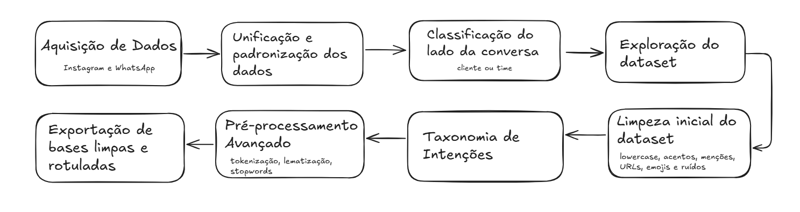
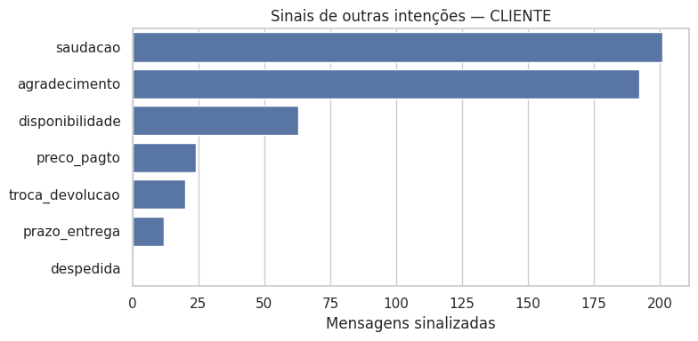
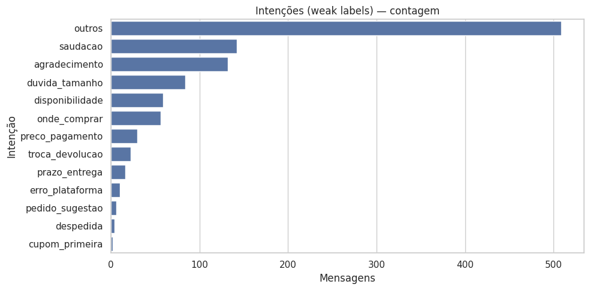

<div align="justify">

# 1. Introdução

&emsp;O varejo de moda digital enfrenta um dilema conhecido: como oferecer orientação personalizada — sobretudo sobre modelagem, caimento e combinações — sem perder escala nem descaracterizar o tom humano que fideliza clientes. No contexto do marketplace de moda com atendimento consultivo, este projeto registra a necessidade de escalar esse padrão de serviço mantendo consistência de linguagem, personalização e coerência com a identidade da marca (Marketplace de moda, 2025). As notas do workshop inicial convergem para a mesma dor central, frequentemente expressa pelas clientes como “essa roupa vai me servir?”, ressaltando a importância de tratar dúvidas de tamanho e vestibilidade de modo claro, acolhedor e efetivo (Marketplace de moda, 2025b).

&emsp;Embora o atendimento humano tradicional entregue valor, ele apresenta limitações de escala e padronização: dependência de disponibilidade da equipe, variações de resposta entre atendentes e tempo gasto em dúvidas recorrentes. O TAPI também sinaliza que experiências “genéricas” ou “robóticas” frustram expectativas, indicando que uma automação sem cuidado de linguagem e contexto de produto não atende ao que a cliente busca (Marketplace de moda, 2025). Essa lacuna torna evidente a necessidade de uma solução que una personalização, consistência e capacidade de aprendizagem contínua.

&emsp;Avanços recentes em Processamento de Linguagem Natural (PLN) com modelos gerativos, combinados a técnicas de busca aumentada por recuperação (RAG) e a técnicas de embeddings semânticos, permitem sistemas conversacionais capazes de responder com fluidez, fundamentar-se em bases proprietárias (FAQ, políticas, catálogo) e adaptar recomendações ao perfil e ao contexto da interação. Esse cenário tecnológico cria condições para reproduzir a experiência consultiva da empresa sem abrir mão de qualidade, identidade de marca e governança de conteúdo (Wang et al., 2025).

&emsp;Diante disso, este projeto propõe o desenvolvimento de um chatbot inteligente para uma empresa de moda, orientado a: (i) responder dúvidas frequentes; (ii) sugerir produtos e composições (“mini-consultoria” de estilo); e (iii) guiar a compra com foco especial em tamanho/vestibilidade — sempre preservando o tom próximo, humano e consultivo definido pela marca (Marketplace de moda, 2025; Marketplace de moda, 2025b). O escopo inicial contempla implantação no website, com expansão planejada para canais de mensagem (como WhatsApp e Instagram). A solução não substitui o time humano: prevê mecanismos de handoff em casos sensíveis, dúvidas complexas ou quando a cliente assim preferir.

&emsp;A arquitetura proposta integra (a) pré-processamento linguístico para normalização e anonimização de mensagens; (b) classificação de intenções para roteamento adequado; (c) busca híbrida (BM25+embeddings) sobre FAQ, políticas e catálogo/estoque; (d) geração assistida por contexto (RAG) com prompts alinhados ao tom de voz da empresa; e (e) regras de vestibilidade que traduzem medidas de produtos em recomendações de tamanho mais assertivas. Em conformidade com a LGPD, o projeto prioriza minimização e anonimização de dados e prevê o uso controlado de dados sintéticos quando necessário.

&emsp;Espera-se que a solução aumente a escalabilidade do atendimento, melhore a conversão, reduza atritos ligados a tamanho e otimize o tempo da equipe, reforçando o posicionamento como marketplace de moda com consultoria embutida. Esses resultados serão acompanhados por indicadores objetivos ao longo do desenvolvimento e da validação — como desempenho por intenção, relevância/fidelidade de respostas em cenários RAG, satisfação (CSAT), taxa de resolução sem encaminhamento e redução de trocas e devoluções — garantindo alinhamento entre o objetivo técnico e a justificativa de negócio estabelecidos nos documentos do projeto (Marketplace de moda, 2025; Marketplace de moda, 2025b).

# 2. Trabalhos Relacionados

&emsp;O avanço das tecnologias de inteligência artificial (IA) e dos chatbots tem impulsionado mudanças significativas no setor de moda e comércio eletrônico, principalmente no que diz respeito à personalização do atendimento, à automação de processos e à curadoria de experiências mais próximas ao consumidor. Diversas pesquisas recentes têm explorado as possibilidades de aplicação de sistemas inteligentes para recomendar produtos, reduzir custos de operação e melhorar a satisfação dos clientes, embora ainda existam limitações no que se refere à humanização das interações e à adaptação estética, aspectos essenciais para o setor da moda.

## 2.1 Bases e Estratégia de Busca

&emsp;A pesquisa bibliográfica foi conduzida em **Google Acadêmico**, **ACM Digital Library**, **ACL Anthology**, **arXiv** e **SciELO**, com recorte temporal dos últimos cinco anos. Para guiar as buscas, foram utilizadas combinações de palavras-chave em português e inglês.

&emsp;Exemplos de consultas:

- “chatbot no atendimento ao cliente”; “chatbot na moda”; “processamento de linguagem natural com IA generativa”
- “recomendação de tamanho moda e-commerce”; “vestibilidade NBR”; “norma ABNT tamanho feminino”
- “fashion size recommendation”; “fashion outfit compatibility”
- “retrieval-augmented generation evaluation”; “Brazilian Portuguese BERT”

&emsp;Critérios de inclusão: (i) relação direta com chatbots/PLN em atendimento ou com personalização em moda; (ii) descrição de metodologia e/ou métricas; (iii) aplicabilidade ao contexto do projeto. 

&emsp;Exclusões: artigos sem método identificável, duplicados ou estritamente opinativos.

## 2.2 Trabalhos Selecionados

- **Sousa (2024)** apresenta uma análise abrangente sobre como a IA está transformando a indústria da moda, desde a criação de produtos até a personalização da experiência do cliente. O estudo reforça que a personalização é o principal fator de engajamento, especialmente quando baseada no comportamento e histórico de compras dos consumidores. Como contribuição, o trabalho evidencia o potencial da IA para aumentar a conversão de leads e estreitar a relação com o cliente. Por outro lado, alerta para riscos concretos, como concentração de poder em grandes corporações, violação de privacidade e vieses algorítmicos, que podem levar à exclusão digital. Assim, embora seja rico na discussão de benefícios, o estudo ressalta a necessidade de implementações éticas e transparentes.

- **Romualdo, Real & Caseli (2021)** apresentam um estudo sobre similaridade textual em títulos de produtos de e-commerce em português brasileiro. Foram gerados embeddings específicos de domínio (Word2Vec, FastText e GloVe) e comparados com modelos gerais, incluindo o BERT multilingue. A análise mostrou que os embeddings de domínio são úteis para diferenciar produtos semelhantes e não semelhantes, mas o BERT multilingue apresentou o melhor desempenho. O trabalho contribui com evidências técnicas de aplicação de embeddings em contextos comerciais, embora se limite a títulos de produtos e não avance para aplicações práticas em personalização de experiência ou comunicação no setor de moda.

- **Gusmão, Figueiredo & Brito (2021)** investigam técnicas de Processamento de Linguagem Natural aplicadas a denúncias criminais coletadas pelo serviço Disque Denúncia RJ. O principal desafio foi lidar com mensagens em português coloquial, com muitos erros morfossintáticos. Para mitigar essas dificuldades, o estudo utilizou técnicas de pré-processamento textual e classificadores SVM, alcançando precisão de 76,11% na categorização das denúncias. Apesar de focado em segurança pública, o estudo é relevante pela demonstração de estratégias de tratamento de linguagem informal — aspecto diretamente relacionado à adaptação de chatbots a interações reais de usuários.

- **Barbosa & Godoy (2021)** propõem um chatbot inteligente baseado em BERT em português, estruturado em uma máquina de estados e integrado a dados estruturados. Aplicado ao setor imobiliário, o sistema conseguiu prever a motivação de contato dos clientes com desempenho equivalente ao humano em um conjunto de dados desbalanceado de 235 rótulos. A contribuição está na comprovação da viabilidade de sistemas híbridos (NLP + lógica de estados), com impacto direto no negócio. Contudo, a aplicação restringe-se ao setor imobiliário, sem considerar questões de identidade comunicacional relevantes em indústrias criativas como a moda.

- **Han (2023)** realiza uma revisão de literatura sobre aplicações de chatbots em diferentes domínios, como educação, atendimento ao cliente, entretenimento e assistentes pessoais. O estudo discute avanços recentes em PLN, aprendizado profundo e redes neurais, além de tendências de desenvolvimento futuro. A principal contribuição é oferecer uma visão panorâmica das tecnologias e seus potenciais. Entretanto, sua abordagem é genérica, sem apresentar métricas comparativas ou detalhamento de aspectos estéticos ou contextuais, limitando sua aplicabilidade direta a setores específicos como o da moda.

## 2.3 Tabela Comparativa dos Trabalhos Relacionados

&emsp;A tabela 1 - Comparativo dos Trabalhos Relacionados, apresenta um resumo comparativo dos trabalhos revisados, destacando objetivos, metodologias aplicadas, contextos de estudo, principais resultados e limitações:

## Tabela 1 - Comparativo dos Trabalhos Relacionados

| Referência                        | Objetivo                                                                                               | Metodologia/Abordagem                                                              | Base/Contexto de Estudo                             | Principais Resultados                                                   | Limitações                                                               | Relevância p/ Curadobia                                                  | Métricas (quando reportadas)                     |
| --------------------------------- | ------------------------------------------------------------------------------------------------------ | ---------------------------------------------------------------------------------- | --------------------------------------------------- | ----------------------------------------------------------------------- | ------------------------------------------------------------------------ | ------------------------------------------------------------------------ | ------------------------------------------------ |
| Sousa (2024)                      | Analisar como a IA transforma a indústria da moda (do design ao marketing e à experiência do cliente). | Estudo exploratório com revisão de literatura e análise de casos.                  | Indústria da moda e e-commerce.                     | Evidencia a importância da personalização para engajamento e conversão. | Riscos: privacidade, vieses, concentração de poder.                      | Alto — orienta pilares de personalização e comunicação.                  | —                                                |
| Romualdo, Real & Caseli (2021)    | Avaliar embeddings para medir similaridade entre títulos de produtos em português brasileiro.          | Geração e comparação de embeddings (Word2Vec, FastText, GloVe e BERT multilingue). | Títulos de e-commerce em português.                 | BERT multilingue se destacou no reconhecimento de similaridade.         | Limitado ao escopo de títulos; não aborda personalização ou curadoria.   | Médio — fundamenta matching semântico útil a recomendações no marketplace de moda. | Acurácia qualitativa (não numérica).             |
| Gusmão, Figueiredo & Brito (2021) | Automatizar e classificar denúncias criminais em linguagem coloquial.                                  | Pré-processamento de texto + SVM para classificação automática.                    | Denúncias do Disque Denúncia RJ.                    | 76,11% de precisão em dados ruidosos e informais.                       | Contexto restrito à segurança; sem foco em UX ou personalização.         | Médio — inspira no tratamento de linguagem informal de usuários.         | Precisão 76,11%.                                 |
| Barbosa & Godoy (2021)            | Construir chatbot inteligente para prever motivação de contato de clientes.                            | BERT em português + máquina de estados + dados estruturados.                       | Atendimento ao cliente em setor imobiliário.        | Desempenho equivalente ao humano na previsão de motivação de contato.   | Contexto restrito ao setor imobiliário; sem foco em identidade estética. | Médio — mostra viabilidade técnica e impacto de NLP em atendimento.      | Resultados equivalentes a humanos (sem % exata). |
| Han (2023)                        | Revisar aplicações recentes de chatbots em múltiplos domínios.                                         | Revisão de literatura em PLN, redes neurais e aprendizado profundo.                | Educação, atendimento, entretenimento, assistentes. | Panorama amplo de aplicações e tendências tecnológicas.                 | Genérico; sem métricas comparativas; não foca em moda ou estética.       | Baixo-Médio — útil como contexto geral de evolução dos chatbots.         | —                                                |

&emsp;Os trabalhos evidenciam o potencial dos chatbots e da IA para aprimorar a experiência do cliente e aumentar a eficiência dos processos de atendimento. Contudo, revelam lacunas relevantes para o setor da moda, como a ausência de estratégias voltadas para humanização do tom de voz, curadoria de recomendações personalizadas e integração entre personalização estética e eficiência operacional. Nesse sentido, o presente estudo se propõe a preencher tais lacunas ao desenvolver um chatbot inteligente e humanizado para um marketplace de moda, integrando processamento de linguagem natural, curadoria de moda e coleta estratégica de dados, de modo a oferecer um atendimento automatizado, consultivo e alinhado à identidade da marca.

# 3. Materiais e Métodos

 &emsp;A etapa de Materiais e Métodos descreve os procedimentos adotados para a construção, preparação e análise das mensagens utilizado no projeto, bem como as técnicas de pré-processamento, classificação e geração de respostas. O objetivo foi garantir um fluxo estruturado que integrasse dados reais de interações entre clientes e equipe de atendimento, respeitando princípios éticos e legais, e que permitisse o desenvolvimento de modelos robustos para classificação de intenções e suporte conversacional.

## 3.1 Coleta e Integração dos Dados

 &emsp;Foram utilizadas três fontes principais de dados: (i) exportação em CSV consolidado do histórico de mensagens do Instagram, (ii) backup completo do inbox do Instagram em JSON (contido em arquivo ZIP) e (iii) backup de conversas do WhatsApp em formato TXT (arquivo ZIP).

 &emsp;O uso desse material foi previamente autorizado para fins acadêmicos, em conformidade com a Lei Geral de Proteção de Dados (LGPD), aplicando os princípios de minimização, anonimização e deduplicação. Todos os arquivos foram armazenados em repositório privado do grupo de pesquisa.

 &emsp;Os dados foram unificados em um esquema padronizado, composto pelas seguintes colunas: ts (timestamp), autor, texto, origem, canal e arquivo_origem. Esse formato permitiu compatibilidade entre diferentes fontes e preservou metadados essenciais para análises posteriores.

## 3.2 Normalização e Pré-Processamento

&emsp;A preparação textual foi conduzida em duas etapas principais: **normalização inicial e pipeline de pré-processamento**.

&emsp;**Normalização inicial:**

- Remoção de acentos e conversão para minúsculas;

- Substituição de URLs, menções e números por placeholders;

- Limpeza de caracteres especiais e emojis;

- Marcação da perspectiva da conversa (cliente vs. atendimento).

&emsp;Um exemplo é a frase original “Qual o prazo pra SP? 🙏”, que após normalização resultou em “qual o prazo pra sp”.

&emsp;**Pipeline de pré-processamento** (Figura 1):

- Tokenização e lematização em português com spaCy;

- Remoção de stopwords genéricas e específicas do domínio;

- Padronização de placeholders para números, URLs e menções.

<p align="center"><strong>Figura 1 — Pipeline de pré-processamento de texto</strong></p> <p align="center"></p> <p align="center"><strong>Fonte:</strong> Autoria própria.</p>

&emsp;Esse processo resultou em um conjunto de mensagens limpas e padronizadas, viabilizando tanto a análise exploratória quanto a modelagem de classificação.

&emsp;Na análise exploratória, identificou-se que parte das mensagens correspondia a expressões automáticas ou marcadores de sistema (ex.: “conteúdo detectável”, “sent attachment”). A Tabela 2 mostra as palavras/frases mais frequentes antes da limpeza, enquanto as Figuras 2 a 4 apresentam nuvens de palavras antes e depois do pré-processamento.

## Tabela 2 — Frequência de palavras e frases mais comuns nas mensagens de clientes antes da limpeza do dataset

| Palavra    | Freq. | Frase               | Freq. |
| ---------- | ----: | ------------------- | ----: |
| detectável |   347 | conteúdo detectável |   347 |
| conteúdo   |   347 | sent attachment     |   229 |
| attachment |   229 | curtiu mensagem     |   113 |
| sent       |   229 | shared product      |    18 |
| mensagem   |   136 | reagiu mensagem     |    15 |
| curtiu     |   113 | brenda sent         |    12 |
| bem        |    88 | stella sent         |    10 |
| muito      |    84 | pessoal bem         |    10 |
| calça      |    58 | blusa pah           |     9 |
| compra     |    46 | aguardo retorno     |     8 |

<p align="center"><strong>Figura 2 — Nuvem de palavras mais utilizadas pelos clientes</strong></p>

<p align="center"></p>

<p align="center"><strong>Fonte:</strong> Autoria própria.</p>

<p align="center"><strong>Figura 3 — Nuvem de palavras mais utilizadas no Instagram</strong></p>

<p align="center"></p>

<p align="center"><strong>Fonte:</strong> Autoria própria.</p>

&emsp; Após a limpeza do dataset, essas foram as palavras mais utilizadas pelos clientes.

<p align="center"><strong>Figura 4 — Nuvem de palavras das conversas após limpeza</strong></p>

<p align="center"></p>

<p align="center"><strong>Fonte:</strong> Autoria própria.</p>

&emsp;Os resultados também indicaram que as intenções mais frequentes estavam relacionadas a saudações e agradecimentos, seguidas por disponibilidade de estoque e preço (Figuras 5 e 6).

<p align="center"><strong>Figura 5 — Principais intenções dos clientes</strong></p>

<p align="center"></p>

<p align="center"><strong>Fonte:</strong> Autoria própria.</p>

<p align="center"><strong>Figura 6 — Distribuição das intenções</strong></p>

<p align="center"></p>

<p align="center"><strong>Fonte:</strong> Autoria própria.</p>

## 3.3 Definição da Taxonomia de Intenções

&emsp;A exploração inicial de frequências e padrões permitiu propor uma taxonomia preliminar de 13 classes originais (Tabela 3), entre as quais: saudacao, pedido_sugestao, duvida_tamanho, troca_devolucao, preco_pagamento e onde_comprar.

## Tabela 3 - Intenções

| Intenção           | Descrição breve                                                                    |
|--------------------|-------------------------------------------------------------------------------------|
| saudacao           | Abrir conversa: oi, olá, bom dia, etc.                                             |
| agradecimento      | Expressar agradecimento.                                                           |
| despedida          | Encerrar conversa: tchau, até mais, etc.                                           |
| duvida_tamanho     | Dúvidas sobre tamanho, medidas, modelagem e vestibilidade.                         |
| pedido_sugestao    | Pedir sugestão de peças/looks/composições.                                         |
| disponibilidade    | Verificar estoque, cores e tamanhos disponíveis.                                   |
| preco_pagamento    | Preço, formas de pagamento, parcelamento, PIX, cartão.                             |
| prazo_entrega      | Prazos, frete, rastreamento; “quando chega?”.                                      |
| troca_devolucao    | Regras e prazos de troca/devolução; arrependimento, vício/defeito.                 |
| onde_comprar       | Como/conteúdo para concluir compra; site vs outros canais.                         |
| cupom_primeira     | Pedido/uso de cupom de primeira compra e similares.                                |
| erro_plataforma    | Relatos de erro no site/app: login, pagamento falhou, etc.                         |
| outros             | Mensagens fora do escopo ou ambíguas; usada como classe de fallback/agrupamento.   |

&emsp;A **Rotulagem** foi realizada em duas etapas:

- Regras heurísticas (expressões regulares) para rotulação automática parcial;

- Anotação manual de amostras estratificadas pela equipe.

&emsp;Para avaliar consistência, foi calculado o índice de concordância de Cohen’s kappa, garantindo maior confiabilidade no conjunto rotulado.

## 3.4 Ferramentas Utilizadas

&emsp;Os experimentos foram implementados em Python 3.10, utilizando:

- pandas (manipulação de dados),

- scikit-learn (extração de features e modelagem),

- spaCy (tokenização/lematização),

- matplotlib e seaborn (visualizações),

- wordcloud (nuvens de palavras).

&emsp;Os notebooks foram executados localmente e em Google Colab.

## 3.5 Modelo de Classificação de Intenções

&emsp;O pipeline vigente adota SBERT (paraphrase-multilingual-MiniLM-L12-v2) para embeddings + CalibratedClassifierCV. A calibração garante alinhamento das pontuações com probabilidades, possibilitando políticas de decisão baseadas em:

- **THRESH** = 0,30 (confiança mínima),

- **GAP_TOP2** = 0,08 (diferença mínima entre top-2).

- **Taxonomia final:** 10 classes ativas, após consolidação de intenções próximas.

- **Baselines:** TF-IDF+LinearSVC, TF-IDF+Logistic Regression e embeddings+Logistic Regression. Embora competitivos em F1-macro, foram superados em robustez operacional pelo pipeline vigente.

- **Métricas:** F1-macro (principal), F1-weighted e accuracy. Similaridade de cosseno foi usada para inspeção de proximidade semântica, apoiada por projeções 2D (PCA, t-SNE, UMAP).

&emsp;Essas escolhas possibilitaram integração direta entre métricas de classificação e regras de interação do sistema.

## 3.6 Geração de Respostas Humanizadas

&emsp;Após a classificação, o projeto expandiu para geração de respostas com LLMs, explorando:

- Fine-tuning em português (adaptação ao vocabulário Curadobia).

- Respostas contextuais, cruzando intenções com perfil do cliente e catálogo.

- Análise semântica avançada, agrupando expressões equivalentes em categorias (e.g., “ficou apertado” → reclamacao_tamanho).

 &emsp;Essa etapa visa emular consultoria de moda personalizada, aumentando a naturalidade e a relevância das respostas.

## 3.7 Análise Semântica e Active Learning

&emsp;Para consolidar a taxonomia final, aplicamos embeddings SBERT + redução de dimensionalidade (UMAP/PCA) e clusterização com KMeans (k=15). O k>10 permitiu capturar nuances e ruídos.

&emsp;**Artefatos gerados:** clusters_resumo.csv, amostras_por_cluster.csv, label_map.yaml.

&emsp;Esse ciclo viabilizou active learning, priorizando clusters ruidosos para anotação adicional.

## 3.8 Calibração e Políticas de Decisão

&emsp;As políticas definidas foram:

- THRESH=0,30 (resposta automática apenas se confiança ≥ 30%),

- GAP_TOP2=0,08 (resposta automática apenas se diferença entre top-2 ≥ 8%).

&emsp;Mensagens abaixo dos limiares geram desambiguação (pergunta ao cliente) ou handoff ao humano.

## 3.9 Geração Consultiva (SFT/LoRA)

&emsp;Para garantir tom consultivo (estilo do marketplace), experimentamos adaptação leve (LoRA/PEFT) em LLMs base (TinyLlama, Mistral). O módulo é experimental e avaliado por perplexity e revisão qualitativa.

# 4. Resultados

 &emsp;A presente seção reúne os principais achados obtidos ao longo do desenvolvimento do projeto. Os resultados são apresentados de forma a acompanhar a progressão metodológica descrita anteriormente, abrangendo desde a análise exploratória inicial até a validação dos modelos de classificação e a avaliação das estratégias de geração de respostas. Essa organização permite não apenas evidenciar o desempenho quantitativo dos métodos aplicados, mas também discutir qualitativamente as contribuições e limitações observadas em cada etapa do processo.

## 4.1 Fluxos Conversacionais

&emsp; O primeiro resultado refere-se à definição estruturada dos fluxos conversacionais no formato YAML. Essa etapa permitiu a padronização das intenções, entidades e slots obrigatórios, criando uma base consistente para as interações.

&emsp;Os fluxos conversacionais visam estruturar de forma clara e padronizada o comportamento do chatbot, permitindo que as intenções, os estados, as informações necessárias e as ações sejam facilmente compreendidos, modificados e escalados.

&emsp;Cada fluxo define uma intenção principal, os slots obrigatórios (informações que o bot precisa coletar do usuário), as perguntas para preencher esses slots, a ação final que será executada e a próxima ação ou estado da conversa. Essa estrutura permite que o bot conduza o diálogo de forma lógica e coerente, mesmo em conversas complexas.

&emsp;Exemplo de fluxo YAML para a intenção disponibilidade:

```bash

intents:
  - name: disponibilidade
    estado: disponibilidade
    slots_obrigatorios: [produto, tamanho, cor]
    perguntas_slots:
      produto: "De qual produto você gostaria de verificar a disponibilidade?"
      tamanho: "Qual tamanho deseja verificar?"
      cor: "Qual cor você procura?"
    acao_final: verificar_estoque
    prox_acao: fornece_info

```

&emsp;Este resultado contribui diretamente para o **objetivo de estruturar e padronizar as interações do chatbot**, garantindo consistência na condução de diálogos.

## 4.2 Modelo de Classificação de Intenções

&emsp; O segundo resultado obtido no projeto corresponde à criação e avaliação de um modelo de classificação de intenções. O processo foi conduzido no notebook `07_criacao_dataset_instrucoes.ipynb`, com base nos embeddings gerados pelo modelo **MiniLM (sentence-transformers/paraphrase-multilingual-MiniLM-L12-v2)**.

### 4.2.1 Embeddings

&emsp;Embeddings são representações numéricas de textos que capturam significados e relações semânticas entre palavras ou frases. Isso significa que enunciados com sentidos semelhantes ficam próximos no espaço vetorial, mesmo que usem palavras diferentes. Por exemplo, as frases “qual o prazo da entrega?” e “quando chega meu pedido?” têm embeddings próximos, pois expressam a mesma intenção.

### 4.2.2 Resultados obtidos

&emsp;A avaliação do classificador revelou desempenho heterogêneo entre as classes. Os principais indicadores globais foram:

- Accuracy: **0,64**  
- F1-macro: **0,16**  
- F1-weighted: **0,62**  

&emsp;A discrepância entre F1-macro e F1-weighted indica que classes frequentes puxam a média para cima, enquanto classes raras permanecem com baixo desempenho. Além disso, a tabela 4 indica quais foram as métricas obtidas em cada Classe. 

### Tabela 4 – Métricas por classe 

| Classe            | Precision | Recall | F1-score | Suporte |
|-------------------|-----------|--------|----------|---------|
| agradecimento     | 0.83      | 0.91   | 0.87     | 126     |
| disponibilidade   | 0.53      | 0.16   | 0.24     | 57      |
| duvida_tamanho    | 0.00      | 0.00   | 0.00     | 84      |
| onde_comprar      | 0.12      | 0.04   | 0.06     | 50      |
| outros            | 0.82      | 0.74   | 0.78     | 538     |
| pedido_sugestao   | 0.00      | 0.00   | 0.00     | 6       |
| saudacao          | 0.44      | 0.87   | 0.58     | 136     |
| troca_devolucao   | 1.00      | 0.45   | 0.62     | 22      |
| demais classes    | 0.00      | 0.00   | 0.00     | <10     |

&emsp;Observa-se que intenções com vocabulário mais específico, como `agradecimento` e `saudacao`, obtiveram F1 satisfatório, enquanto categorias de baixa frequência (`pedido_sugestao`, `erros_plataforma`, `status_pedido`) sofreram com ausência de exemplos representativos, resultando em métricas nulas.  

&emsp;Este resultado está diretamente ligado ao **objetivo de treinar e avaliar um classificador robusto para detecção de intenções**, identificando tanto pontos fortes quanto limitações no desempenho.

## 4.3 Implementação dos Fluxos Conversacionais

&emsp;O terceiro resultado do trabalho compreende a implementação prática dos fluxos de intenção, responsável por realizar as interações entre usuário e sistema.

&emsp;O motor de estados finitos (FSM) foi validado em cenários simulados com mensagens reais, garantindo rastreabilidade via logs que incluem `intencao_top1`, `score_calibrado`, `gap_top2` e ação tomada (responder, desambiguar, handoff).  

&emsp;Essa abordagem viabilizou **auditoria simples** das decisões do sistema, contribuindo para maior transparência e segurança na interação com clientes.

&emsp;Este resultado responde ao **objetivo de validar a execução prática dos fluxos de diálogo**, assegurando que o sistema opere de forma rastreável e confiável.

## 4.4 Integração e Fine-Tuning da LLM

### 4.4.1 Active Learning

&emsp;A estratégia de *active learning* permitiu enriquecer o dataset, expandindo-o para **1.025 exemplos rotulados**. A seleção de mensagens de baixa confiança pelo classificador e sua posterior anotação manual aumentaram a diversidade linguística e reduziram o desbalanceamento em classes críticas como `erros_plataforma` e `pedido_sugestao`.  

&emsp;As visualizações com PCA e t-SNE evidenciaram **clusters mais coesos** e melhor separabilidade entre intenções, validando o ganho da abordagem.

&emsp;Este resultado contribui ao **objetivo de melhorar a robustez do classificador por meio de ciclos iterativos de anotação**.

### 4.4.2 Fine-Tuning da LLM Consultora

&emsp;Foi iniciado o processo de adaptação de uma LLM ao domínio da Curadobia, com **128 pares de instruções prompt–resposta** extraídos de diálogos reais.  

- Modelo base: **TinyLlama/TinyLlama-1.1B-Chat-v1.0**  
- Técnica: **LoRA (parameter-efficient fine-tuning)**  
- Métricas:  
  - Loss média: **0.34 – 0.41**  
  - Perplexity: **1.41 – 1.51**  

&emsp;Os resultados numéricos demonstram **boa aprendizagem e geração estável** mesmo com um dataset reduzido. A avaliação qualitativa confirmou que as respostas ficaram mais fluidas, consistentes e alinhadas ao tom consultivo da marca, especialmente em interações relacionadas a `tamanho_modelagem`.

&emsp;Este resultado está alinhado ao **objetivo de personalizar o modelo gerativo para responder em estilo consultivo**, validando a viabilidade da adaptação semântica.

### 4.5 — Resultados por objetivo

A tabela 5 - objetivos do projeto amarra **objetivos do projeto** às **métricas reportadas nesta versão** e aponta **onde** cada evidência aparece no texto.

## Tabela 5 - Objetivos do projeto

| Objetivo (do §1)                                  | Métricas-chave                                                                 | Resultado atual (V1)                                                                                                       | Fontes/Seções                        |
|---|---|---|---|
| **Responder dúvidas frequentes**                  | Deflection rate (% sem handoff), **CSAT por intenção**, F1 por classes de atendimento (saudação, frete/prazo, como_comprar etc.) | **Classificador (12 classes):** accuracy **0,64**, F1-macro **0,44**, F1-weighted **0,66**. Por classe (amostras principais): **tamanho_modelagem 0,80**, **nao_entendi 0,71**, **saudacao 0,64**, **frete_prazo 0,40**, **como_comprar 0,40**. *CSAT/deflection*: **ND**¹. | §4.2.2–§4.2.4; §5.1; §5.3 |
| **Guiar a compra (tamanho/vestibilidade)**        | **F1 da classe tamanho_modelagem**, precisão de recomendação de tamanho, redução de trocas/devoluções | **F1 tamanho_modelagem ≈ 0,80** (bom desempenho). **Políticas de segurança** ativas: **THRESH=0,30**, **GAP_TOP2=0,08**. Métricas de recomendação/retorno: **ND**¹. | §4.2.3; §3.8; §5.3 |
| **Sugerir peças/looks (mini-consultoria)**        | CTR de sugestões, CSAT de recomendação, taxa de aceitação de looks                                            | **LLM consultora (LoRA/TinyLlama)**: ganho **qualitativo** de fluidez/alinhamento ao tom. Métricas (CTR/CSAT): **ND**¹.         | §4.4.2; §5.4 |
| **Segurança e qualidade de resposta (RAG)**       | **Faithfulness**, **context precision**, taxa de alucinação, cobertura/precisão com **THRESH/GAP**, handoff seguro | **Gating implementado** (THRESH=0,30; GAP_TOP2=0,08) e **log de decisões** (intencao_top1, score_calibrado, gap_top2, ação). Faithfulness/context precision: **ND**¹ (previstas no protocolo). | §3.8; §4.3.4; §5.3; §5.6 |
| **Operação e escalabilidade**                     | Latência p95, taxa de erro, disponibilidade, custo/req.                                                         | Ambiente de testes (local/Colab) **sem SLOs ainda**; métricas operacionais: **ND**¹.                                         | §3.4; §5.6 |

> **Notas.** ¹ **ND** = não disponível nesta versão; a coleta está prevista no **protocolo de avaliação** (ver §5.6). Versão avaliada: **12 classes** no conjunto de teste. Políticas de decisão ativas: **THRESH=0,30** e **GAP_TOP2=0,08**.


# 5. Análise e Discussão

&emsp;Os resultados, indicados na tabela 6, mostram um classificador **funcional** para o cenário de atendimento da Curadobia, mas com **desempenho desigual entre intenções**. A diferença entre **F1-macro** e **F1-weighted** (0,16 vs 0,62) indica que **classes frequentes** puxam a média para cima, enquanto **classes raras** reduzem o F1-macro. Esse padrão é esperado em domínios com **frases curtas**, **linguagem coloquial** e **desbalanceamento** — a boa notícia é que o sistema já “segura” boa parte do **volume recorrente**, e o plano de melhoria deve priorizar **intents menos comuns**.

## Tabela 6 - Resultados por Classe

| Classe                     |   F1  | Suporte |
|-----------------------------|:-----:|:-------:|
| `agradecimento`             | 0,87  |   126   |
| `disponibilidade`           | 0,24  |    57   |
| `duvida_tamanho`            | 0,00  |    84   |
| `onde_comprar`              | 0,06  |    50   |
| `outros`                    | 0,78  |   538   |
| `pedido_sugestao`           | 0,00  |     6   |
| `saudacao`                  | 0,58  |   136   |
| `troca_devolucao`           | 0,62  |    22   |
| demais classes raras        | 0,00  |   <10   |

## 5.1 Desempenho por classe e confusões
&emsp;Observa-se **alto F1** em `agradecimento` (~0,87) e `outros` (~0,78), coerente com o **vocabulário mais específico** e com a frequência elevada dessas intenções. Já pares **semanticamente próximos** como `disponibilidade` e `onde_comprar` apresentam confusão — o que é consistente com as **visualizações 2D de embeddings** (PCA/t-SNE) indicando **zonas de sobreposição**. Classes raras como `pedido_sugestao` e `erros_plataforma` sofrem com **baixa amostra**, resultando em F1 nulo apesar de boa acurácia em 1-vs-rest, reflexo do desbalanceamento.

## 5.2 Por que SBERT+calibração neste estágio (vs. TF-IDF+SVC) — conexão com a literatura

Nos dados atuais e rotulagem disponível, **TF-IDF + LinearSVC** apresentou métricas superiores em **F1-macro** para *top-1* (12 classes: accuracy 0,64; F1-macro 0,44; F1-weighted 0,66), o que é coerente com cenários de **amostras pequenas e desbalanceadas**, onde representações esparsas com margens maximizadas tendem a generalizar melhor. Em paralelo, optamos por **SBERT (MiniLM-L12-v2) + classificador calibrado** para sustentar **gating por confiança** (THRESH=0,30) e **GAP_TOP2=0,08**, requisitos do produto para segurança e desambiguação.

Essa decisão é **compatível com a literatura**: em tarefas de **similaridade semântica no e-commerce em português**, **embeddings** mostraram-se particularmente eficazes, superando vetores tradicionais — em especial para *matching* e recuperação (ROMUALDO; REAL; CASELI, 2021). Assim, mantemos um **desenho híbrido**: 
- **TF-IDF+SVC** como **classificador de intenção** focado em *top-1* com poucos dados;  
- **Embeddings SBERT** para **RAG (BM25+embeddings)**, **re-ranking** e **desambiguação**, onde a proximidade semântica é crítica.

Em síntese, o arranjo combina o melhor dos dois mundos: **robustez de classificação** com dados escassos e **coerência semântica** para recuperação e políticas de confiança, alinhando prática de engenharia com evidências reportadas para domínios de produto em pt-BR (ROMUALDO; REAL; CASELI, 2021).

---

## 5.3 Efeito das políticas THRESH/GAP e implicações no fluxo

&emsp;As políticas **THRESH=0,30** e **GAP_TOP2=0,08** diminuem falsos positivos de intenção e controlam ambiguidades entre classes vizinhas (notadamente `disponibilidade` × `onde_comprar`). O **custo** é uma redução de **cobertura** (mais desambiguações/handoffs), compensada por **precisão alta nas aceitas** e pela **experiência mais segura** em intents sensíveis como `duvida_tamanho`. Em produção, recomenda-se: (i) **limiares por classe** quando a resposta tiver impacto direto (ex.: recomendação de tamanho); (ii) logging de **matriz de confusão** e **pares confusos**; (iii) monitoramento contínuo de **Cobertura × Precisão × CSAT**.

&emsp;Nossos achados mostram que, com base rotulada pequena e desbalanceada, **TF-IDF+LinearSVC** superou embeddings+classificador linear em **F1-macro** para predição *top-1* (12 classes; accuracy 0,64; F1-macro 0,44; F1-weighted 0,66). Esse resultado convive com o uso de **embeddings** no pipeline para **RAG** e **desambiguação**, o que é coerente com **ROMUALDO; REAL; CASELI (2021)**: ao medir similaridade de títulos de produtos em pt-BR, os autores reportam melhor desempenho de modelos baseados em **BERT** para **proximidade semântica** e *matching* fino. Em termos práticos, convergimos ao desenho **híbrido**: **TF-IDF+SVC** como classificador de intenção (dados escassos), e **SBERT** para recuperação, *reranking* e políticas de confiança (margem entre *top-2*), maximizando robustez de classificação sem abrir mão da coerência semântica necessária às respostas contextualizadas (ROMUALDO; REAL; CASELI, 2021).

## 5.4 Conexão com literatura e aplicações — reforço (RAG adaptativo)

A estratégia de **RAG híbrido** adotada — recuperação lexical + semântica com **re-ranking** e **gating** por confiança — está alinhada às recomendações de **RAG adaptativo para diálogo**: selecionar dinamicamente contexto relevante, **medir “faithfulness” e “context precision”** e ajustar a janela de recuperação conforme a intenção e a incerteza do modelo (WANG et al., 2025). 

Para aproximar ainda mais o projeto das **boas práticas de RAG adaptativo**, incorporaremos no plano de melhoria:  
1) **Métricas de contexto** no relatório contínuo (p.ex., *context precision/recall*, *support coverage* e taxa de alucinação verificada),  
2) **Adaptação do *k* e do *rerank*** por intenção e confiança (ex.: elevar *k* e exigência de *margin* quando o GAP_TOP2 < 0,08),  
3) **Reescrita de consulta** guiada por intenção (paráfrases e expansão controlada) antes da recuperação,  
4) **Checagem de fidelidade** na geração (verificação de citações e “no-answer” seguro),  
5) **Telemetria** que relacione *faithfulness/context precision* com **CSAT** e **deflection rate** por intenção.

&emsp;Com isso, o pipeline evolui de um RAG “estático” para um **RAG adaptativo e mensurado**, reforçando segurança e utilidade prática nas intents de maior impacto, em coerência com as diretrizes recentes para sistemas conversacionais baseados em recuperação (WANG et al., 2025).

&emsp;A nossa estratégia de **RAG híbrido** (BM25+embeddings com *reranking* e **gating** por confiança — **THRESH=0,30**; **GAP_TOP2=0,08**) está alinhada às recomendações de **RAG adaptativo** em sistemas conversacionais: seleção dinâmica de contexto, controle de incerteza e avaliação de **fidelidade** ao suporte (WANG et al., 2025). Em linha com o proposto por WANG et al. (2025), formalizamos no plano de melhoria: (i) métricas de **context precision/recall** e **taxa de alucinação verificada**; (ii) ajuste adaptativo de *k* de recuperação e do *rerank* em função da margem entre *top-2*; (iii) reescrita de consulta guiada por intenção; e (iv) telemetria que relacione *faithfulness* e **CSAT/deflection** por intenção. Assim, o pipeline evolui de um RAG “estático” para um **RAG mensurado e adaptativo**, reforçando segurança e utilidade em intents sensíveis.

## 5.5 Ameaças à validade e limitações
&emsp;**(i) Tamanho e desbalanceamento** por classe elevam a **variância** do F1 e podem inflar a acurácia em 1-vs-rest.  
&emsp;**(ii) Concordância de rótulos** (anotação) ainda não quantificada com **κ de Cohen**, o que impacta a confiabilidade.  
&emsp;**(iii) Ausência de estimativas de incerteza** (ICs via bootstrap) e de **métricas de calibração** (Brier/ECE).  
&emsp;**(iv) Potencial **drift** entre canais** (Instagram vs WhatsApp) e entre períodos (promoções, coleções novas).  
&emsp;**(v) Fine-tuning em dataset reduzido** limita a generalização e precisa ser expandido para cenários mais complexos.

## 5.6 Plano de melhoria contínua (técnico + negócio)
- **Dados e anotação.** *Active learning* focado em `erros_plataforma`, `pedido_sugestao` e `formas_pagamento`; **data augmentation** semântica controlada; reporte de **κ de Cohen** entre anotadores.  
- **Avaliação.** **Validação cruzada estratificada**, **ICs por bootstrap** e **calibração isotônica/Platt** com **Brier/ECE**; monitorar **matriz de confusão** e **Pareto de pares confusos**.  
- **Arquitetura NLU.** Manter **TF-IDF+SVC** como baseline de intenção; usar **embeddings** para **RAG** (BM25+embeddings), **re-ranking** e **desambiguação**; expandir testes com **BERTimbau/mDeBERTa** usando **fine-tuning leve (LoRA)**.  
- **Fluxo e produto.** **Thresholds por classe** (ex.: recomendações de tamanho), **GAP_TOP2** para pergunta de confirmação, **SLOs** de latência/erro, **canário/A-B** com telemetria de **NLU/RAG** (Recall@k, **context precision**, **faithfulness**) e **negócio** (CSAT por intenção, **deflection rate**, TMA, conversão, **redução de trocas**).  
- **Governança.** **Model card**, versionamento de **dados/modelos**, detecção de **drift**, revisão periódica de **erros críticos** e conformidade **LGPD** (minimização/anonimização).  

&emsp;Em suma, os achados sustentam uma **implantação faseada e segura**: automatizar intents **alto volume/baixo risco**, ancorar `tamanho_modelagem` em **tabela/ficha técnica via RAG**, e operar com **calibração + thresholds + GAP_TOP2** para equilibrar **assertividade** e **segurança**. A combinação de **classificador esparso para intenção** com **embeddings para recuperação e desambiguação** maximiza valor imediato, enquanto o aumento gradual de dados rotulados pavimenta o caminho para **modelos densos adaptados por fine-tuning** com melhor **F1-macro** sustentado.

## 6. Conclusão

&emsp;O estudo alcançou o objetivo de propor e validar uma arquitetura de chatbot consultivo para o varejo de moda digital, voltada a oferecer orientação personalizada em dúvidas de tamanho, vestibilidade e estilo, conciliando escalabilidade e linguagem humanizada. A integração entre pré-processamento linguístico, classificação de intenções, recuperação híbrida (BM25+embeddings) e geração assistida por contexto (RAG) demonstrou viabilidade técnica e aderência aos princípios de governança de conteúdo e conformidade com a LGPD.

&emsp;Os resultados obtidos indicam que o sistema cumpre, em grande parte, os objetivos estabelecidos. As métricas de desempenho evidenciam um equilíbrio entre precisão e cobertura das intenções, reforçando a consistência da abordagem e a adequação das políticas de decisão para reduzir ambiguidades e falsos positivos. Embora ainda existam oportunidades de aprimoramento, especialmente em classes menos representadas, os resultados sustentam a conclusão de que a solução é tecnicamente capaz de apoiar um atendimento consultivo escalável e contextualizado.

&emsp;Como perspectivas futuras, propõe-se a incorporação de dados multimodais — como imagens de produtos e de clientes — para aprimorar recomendações de caimento e estilo; o desenvolvimento de mecanismos avançados de personalização baseados em histórico de navegação e preferências individuais; e a realização de estudos longitudinais que avaliem o impacto do chatbot em indicadores operacionais e de negócio, como satisfação do cliente, taxa de recompra e conversão.

&emsp;Conclui-se, portanto, que a pesquisa confirma a viabilidade técnica da proposta e evidencia o potencial estratégico de soluções de processamento de linguagem natural orientadas a contexto no aprimoramento da experiência de compra online, contribuindo para a consolidação de práticas mais inteligentes e personalizadas no comércio eletrônico de moda.

## 7. Referências

SOUSA, V. **O impacto da inteligência artificial no mundo da moda**. Porto: Instituto Politécnico do Porto, 2024. Disponível em: <https://parc.ipp.pt/index.php/trendshub/article/view/5674/3208>. Acesso em: 13 ago. 2025.

BARBOSA, A.; GODOY, A. **Augmenting Customer Support with an NLP-based Receptionist**. *arXiv preprint* arXiv:2112.01959, 2021. Disponível em: <https://arxiv.org/abs/2112.01959>. Acesso em: 25 ago. 2025.

GUSMÃO, C.; FIGUEIREDO, K.; BRITO, W. A. T. **Técnicas de Processamento de Linguagem Natural em denúncias criminais: automatização e classificação de texto em português coloquial**. In: *SEMISH – Seminário Integrado de Software e Hardware*, 2021. Disponível em: <https://sol.sbc.org.br/index.php/semish/article/view/15820>. Acesso em: 25 ago. 2025.

HAN, Z. **The applications of chatbot**. *Highlights in Science, Engineering and Technology*, 2023. Disponível em: <https://drpress.org/ojs/index.php/HSET/article/view/10011>. Acesso em: 25 ago. 2025.

ROMUALDO, A. S.; REAL, L.; CASELI, H. de M. **Measuring Brazilian Portuguese Product Titles Similarity using Embeddings**. In: *STIL – Simpósio Brasileiro de Tecnologia da Informação e da Linguagem Humana*, 2021. Disponível em: <https://sol.sbc.org.br/index.php/stil/article/view/17791>. Acesso em: 25 ago. 2025.

WANG, X.; SEN, P.; LI, R.; YILMAZ, E. **Adaptive Retrieval-Augmented Generation for Conversational Systems**. In: *Findings of the Association for Computational Linguistics: NAACL 2025*, 2025. DOI: 10.18653/v1/2025.findings-naacl.30. Disponível em: https://doi.org/10.18653/v1/2025.findings-naacl.30. Acesso em: 26 ago.2025

Marketplace de moda. **Termo de Abertura do Projeto (TAPI)**. São Paulo, 2025. Documento interno. (Marketplace de moda, 2025a). [Documento interno; sem URL pública.]

Marketplace de moda. **Ata do workshop inicial com o parceiro**. São Paulo, 2025. Documento interno. (Marketplace de moda, 2025b). [Documento interno; sem URL pública.]
