# FCI-03 � Mapa de Fluxos

Este documento descreve o **mapa de fluxos conversacionais** como uma **m�quina de estados**.
Ele serve de refer�ncia direta para `c�digo/resources/fluxos.yaml` e para a implementa��o com **Padr�o State**.

---

## Legenda
- **Estado**: n� do fluxo (ex.: `CAPTURA_INTENCAO`).
- **Inten��o**: gatilho que dispara a transi��o (ex.: `frete_prazo`).
- **Guarda**: condi��o/slot exigido (ex.: `has(geo.cep)`).
- **A��o**: rotina executada na transi��o/entrada (ex.: `cotar_frete`).
- **FALLBACK**: estado para pedir slot faltante ou solicitar reformula��o.

---

## Diagrama (ASCII)
```
START
  +-> CAPTURA_INTENCAO
       +- pedir_sugestao_produto --> RECOMENDAR --> ENCERRAMENTO
       +- buscar_produto_* --------> BUSCA_PRODUTO --> INFO_ESTOQUE --> ENCERRAMENTO
       +- disponibilidade_estoque -> INFO_ESTOQUE --> ENCERRAMENTO
       +- frete_prazo + CEP -------> INFO_FRETE --> ENCERRAMENTO
       +- frete_prazo (sem CEP) ---> FALLBACK_PEDIR_CEP --(tem CEP?)-> INFO_FRETE
       +- formas_pagamento --------> INFO_PAGAMENTO --> ENCERRAMENTO
       +- status_pedido + pedido.id -> STATUS_PEDIDO --> ENCERRAMENTO
       +- status_pedido (sem id) --> FALLBACK_PEDIR_PEDIDO --(tem id?)-> STATUS_PEDIDO
       +- troca_devolucao_politica -> POLITICA_TROCA --> ENCERRAMENTO
       +- tamanho_modelagem -------> TAMANHO_MODELAGEM ? TAMANHO_MODELAGEM_RESULT ? ENCERRAMENTO
       +- styling_sugestao_look ---> STYLING ? STYLING_RESULT ? ENCERRAMENTO
       +- materiais_cuidados ------> MATERIAIS --> ENCERRAMENTO
       +- como_comprar ------------> COMO_COMPRAR --> ENCERRAMENTO
       +- erros_plataforma --------> SUPORTE_LOGIN --(falar_com_humano?)-> FALAR_HUMANO ? ENCERRAMENTO
       +- cliente_loja_b2b --------> CLIENTE_B2B --> ENCERRAMENTO
       +- pos_venda ---------------> POS_VENDA --(tem pedido.id?)-> ENCERRAMENTO | FALLBACK_PEDIR_PEDIDO
       +- falar_com_humano --------> FALAR_HUMANO --> ENCERRAMENTO
       +- despedida/agradecimento -> ENCERRAMENTO
       +- nao_entendi/any ---------> FALLBACK_PEDIR_REFORMULACAO --> CAPTURA_INTENCAO
```

## Diagrama (Mermaid)

```mermaid
stateDiagram-v2
  [*] --> START
  START --> CAPTURA_INTENCAO

  CAPTURA_INTENCAO --> RECOMENDAR: pedir_sugestao_produto
  CAPTURA_INTENCAO --> BUSCA_PRODUTO: buscar_produto_por_nome/categoria
  CAPTURA_INTENCAO --> INFO_ESTOQUE: disponibilidade_estoque
  CAPTURA_INTENCAO --> INFO_FRETE: frete_prazo && has(geo.cep)
  CAPTURA_INTENCAO --> FALLBACK_PEDIR_CEP: frete_prazo && !has(geo.cep)
  CAPTURA_INTENCAO --> INFO_PAGAMENTO: formas_pagamento
  CAPTURA_INTENCAO --> STATUS_PEDIDO: status_pedido && has(pedido.id)
  CAPTURA_INTENCAO --> FALLBACK_PEDIR_PEDIDO: status_pedido && !has(pedido.id)
  CAPTURA_INTENCAO --> POLITICA_TROCA: troca_devolucao_politica
  CAPTURA_INTENCAO --> TAMANHO_MODELAGEM: tamanho_modelagem
  CAPTURA_INTENCAO --> STYLING: styling_sugestao_look
  CAPTURA_INTENCAO --> MATERIAIS: materiais_cuidados
  CAPTURA_INTENCAO --> COMO_COMPRAR: como_comprar
  CAPTURA_INTENCAO --> SUPORTE_LOGIN: erros_plataforma
  CAPTURA_INTENCAO --> CLIENTE_B2B: cliente_loja_b2b
  CAPTURA_INTENCAO --> POS_VENDA: pos_venda
  CAPTURA_INTENCAO --> FALAR_HUMANO: falar_com_humano
  CAPTURA_INTENCAO --> FALLBACK_PEDIR_REFORMULACAO: nao_entendi
  CAPTURA_INTENCAO --> ENCERRAMENTO: despedida/agradecimento

  BUSCA_PRODUTO --> INFO_ESTOQUE
  RECOMENDAR --> ENCERRAMENTO
  INFO_FRETE --> ENCERRAMENTO
  INFO_PAGAMENTO --> ENCERRAMENTO
  STATUS_PEDIDO --> ENCERRAMENTO
  POLITICA_TROCA --> ENCERRAMENTO
  TAMANHO_MODELAGEM --> TAMANHO_MODELAGEM_RESULT
  TAMANHO_MODELAGEM_RESULT --> ENCERRAMENTO
  STYLING --> STYLING_RESULT
  STYLING_RESULT --> ENCERRAMENTO
  MATERIAIS --> ENCERRAMENTO
  COMO_COMPRAR --> ENCERRAMENTO
  SUPORTE_LOGIN --> FALAR_HUMANO
  CLIENTE_B2B --> ENCERRAMENTO
  POS_VENDA --> ENCERRAMENTO
  FALLBACK_PEDIR_CEP --> INFO_FRETE: has(geo.cep)
  FALLBACK_PEDIR_PEDIDO --> STATUS_PEDIDO: has(pedido.id)
  FALLBACK_PEDIR_REFORMULACAO --> CAPTURA_INTENCAO

  FALAR_HUMANO --> ENCERRAMENTO
  ENCERRAMENTO --> [*]
```


